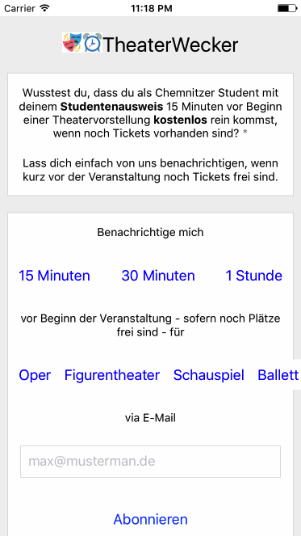

# TheaterWecker App

 
## Run it!

To run your app on iOS:
- `cd /Users/ronny/dev/oklabs/TheaterWecker/app`
- `react-native run-ios`

- or -

- Open `./TheaterWecker/app/ios/TheaterWecker.xcodeproj` in Xcode
- Hit the Run button

To run your app on Android:

- Have an Android emulator running (quickest way to get started), or a device connected
- `cd /Users/ronny/dev/oklabs/TheaterWecker/app`
- `react-native run-android`

## SVGs

- there is no good module for display an SVG file
- so they are converted to PNG
- via ImageMagick `convert -background none ../www/static/img/foobar.svg images/foobar.png`

## Stories

### Init of app

1. App to OneSignal via REST -> Register device (automatically)
2. Create/Register device -> App to Backend via REST -> `POST /api/device {'deviceId':'c732c64a-9409-4af3-b0dc-1ff93e084b5b'}``
3. Fetch all possible categories -> App to Backend via REST -> GET /api/categories

### On first start of app -> Verify device

1. Backend to OneSignal via REST -> Notification with hidden secret (URL to backend with hash)
2. User clicks Notifcation - opens App
3. App to Backend via Ajax -> call URL with hash

- prevents mass user/device creation
- backend needs to cleanup not validated users/devices

### User pushs "abonnieren" button (first time or all other times)

- App to Backend via REST ->  `POST /api/subscribe {'deviceId':'c732c64a-9409-4af3-b0dc-1ff93e084b5b','categories':[]}

